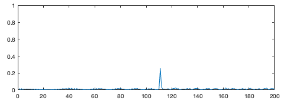
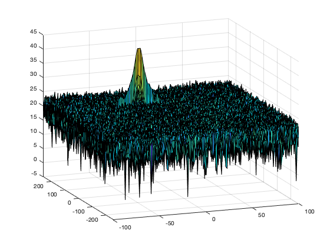
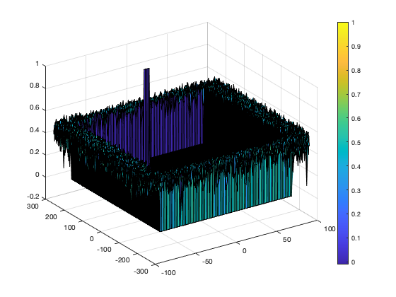
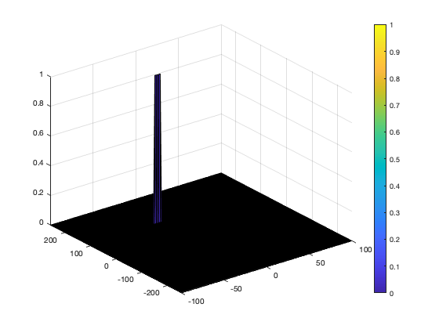

# Radar Target Generation and Detection

The goal of this project is to use MATLAB to implement a Radar target generation and detection system.


This involves a number of steps, as shown in the diagram above:
* Configure the FMCW waveform based on the system requirements.
* Define the range and velocity of target and simulate its displacement.
* For the same simulation loop process the transmit and receive signal to determine the beat signal
* Perform Range FFT on the received signal to determine the Range
* Towards the end, perform the CFAR processing on the output of 2nd FFT to display the target.


## Project Specification

Function | Criteria | Specification | Status
:--- | :--- | :--- | :--- 
**FMCW Waveform Design** | Using the given system requirements, design a FMCW waveform. Find its Bandwidth (B), chirp time (Tchirp) and slope of the chirp. | For given system requirements the calculated slope should be around 2e13 | [DONE](#FMCW-Waveform-Design)
**Simulation Loop** | Simulate Target movement and calculate the beat or mixed signal for every timestamp. |A beat signal should be generated such that once range FFT implemented, it gives the correct range i.e the initial position of target assigned with an error margin of +/- 10 meters. | [DONE](#Simulation-Loop)
**Range FFT (1st FFT)** | Implement the Range FFT on the Beat or Mixed Signal and plot the result. | A correct implementation should generate a peak at the correct range, i.e the initial position of target assigned with an error margin of +/- 10 meters. | [DONE](#Range-FFT)
**2D CFAR** | Implement the 2D CFAR process on the output of 2D FFT operation, i.e the Range Doppler Map. | The 2D CFAR processing should be able to suppress the noise and separate the target signal. The output should match the image shared in walkthrough. | [DONE](#2D-CFAR-implementation)
**2D CFAR** | Create a CFAR README File | In a README file, write brief explanations for the following: <ul><li>Implementation steps for the 2D CFAR process.</li> <li>Selection of Training, Guard cells and offset. </li> <li>Steps taken to suppress the non-thresholded cells at the edges.</li> </ul> | [IN PROGRESS](#PRoject-Report)


# Source Code
The main source code is in the MATLAB file [radar_target_generation_and_detection.m](src/radar_target_generation_and_detection.m). Extracts from the source code are included in this README, with explanations. Refer to the [MATLAB source file](src/radar_target_generation_and_detection.m) for the full, up-to-date source code.


# Project Report


## Range FFT (1st FFT)

The steps for the 1st FFT operation are as follows:
* Implement the 1D FFT on the Mixed Signal
* Reshape the vector into Nr*Nd array.
* Run the FFT on the beat signal along the range bins dimension (Nr)
* Normalize the FFT output.
* Take the absolute value of that output.
* Keep one half of the signal
* Plot the output
* There should be a peak at the initial position of the target

These steps are implemented in the following MATLAB code:

```matlab
%% RANGE MEASUREMENT - FFT Operation

% Implement the 1D FFT on the Mixed Signal

% Reshape the vector into Nr*Nd array. Nr and Nd here would also define 
% the size of Range and Doppler FFT respectively.
Mix = reshape(Mix,[Nr,Nd]);

% Run the FFT on the beat signal along the range bins dimension (Nr) and
% normalize.
sig_fft1 = fft(Mix,Nr);
sig_fft1 = sig_fft1./Nr;

% Take the absolute value of FFT output
sig_fft1 = abs(sig_fft1);

% Output of FFT is double sided signal, but we are interested in only one 
% side of the spectrum. Hence we throw out half of the samples, keeping
% one half of the signal.
single_side_sig_fft1 = sig_fft1(1:Nr/2);

% Plot the range
figure ('Name','Range from First FFT')
subplot(2,1,1)

% plot FFT output; 
% There should be a peak at the initial position of the target 
plot(single_side_sig_fft1); 
 
axis ([0 200 0 1]);
```

The first FFT output is shown below. There is a peak at the initial position of the target located at 110 metres.


## Range Doppler Map
The next task is to implement the CFAR on this Range Doppler Map. This is shown in the following code, where the Range Doppler Map is represented by the variable `RDM`. 

```matlab
%% RANGE DOPPLER RESPONSE
% The 2D FFT implementation is provided here. This will run a 2DFFT
% on the mixed signal (beat signal) output and generate a range doppler
% map. Implement CFAR on the generated Range Doppler Map (RDM).


% Range Doppler Map Generation.

% The output of the 2D FFT is an image that has reponse in the range and
% doppler FFT bins. So, it is important to convert the axis from bin sizes
% to range and doppler based on their Max values.

Mix = reshape(Mix,[Nr,Nd]);

% 2D FFT using the FFT size for both dimensions.
sig_fft2 = fft2(Mix,Nr,Nd);

% Taking just one side of signal from Range dimension.
sig_fft2 = sig_fft2(1:Nr/2,1:Nd);
sig_fft2 = fftshift (sig_fft2);
RDM = abs(sig_fft2);
RDM = 10*log10(RDM) ;

% use the surf function to plot the output of 2DFFT and to show axis 
% in both dimensions
doppler_axis = linspace(-100, 100, Nd);
range_axis = linspace(-200, 200, Nr/2)*((Nr/2)/400);
figure('Name', '2DFFT output - Range Doppler Map')
surf(doppler_axis, range_axis, RDM);
```

The 2nd FFT generates a Range Doppler Map as seen in the image below.




## Implementation steps for the 2D CFAR process


### FMCW Waveform Design

Using the given system requirements, design a FMCW waveform. Find its Bandwidth (B), chirp time (Tchirp) and slope of the chirp. The specifications and MATLAB implementation are shown here:

```matlab
%% Radar Specifications 
%%%%%%%%%%%%%%%%%%%%%%%%%%%
% Frequency of operation = 77GHz
% Max Range = 200m
% Range Resolution = 1 m
% Max Velocity = 100 m/s
%%%%%%%%%%%%%%%%%%%%%%%%%%%
c = 3e8; %speed of light
maxRange = 200;
rangeResolution = 1;
maxVelocity = 100;
```

This code defines the target's initial position and velocity:

```matlab
%% User Defined Range and Velocity of target
% define the target's initial position and velocity. Note : Velocity
% remains contant
initialPosition = 110;
velocity = -20;
```

The _sweep bandwidth_ is determined according to the _range resolution_ and the _sweep slope_ is calculated using both _sweep bandwidth_ and _sweep time_.

_Bandwidth(Bsweep) = speedoflight / (2 * rangeResolution)_

The _sweep time_ can be computed based on the time needed for the signal to travel the unambiguous maximum range. In general, for an FMCW radar system, the sweep time should be at least 5 to 6 times the round trip time. Here we use a factor of 5.5:

_Tchirp = 5.5 * 2 * Rmax / c_

We can now calculate the slope of the chirp signal:

_Slope = Bandwidth / Tchirp_

These are implemented in MATLAB as follows:

```matlab
%% FMCW Waveform Generation

% Design the FMCW waveform by giving the specs of each of its parameters.
% Calculate the Bandwidth (B), Chirp Time (Tchirp) and Slope (slope) of the FMCW
% chirp using the requirements above.
B_sweep = c / (2*range_resolution);   % Bandwidth (B)
T_chirp = 5.5*2*max_range / c;        % Chirp time
slope = B_sweep / T_chirp;            % Slope of the FMCW
```

For the given system requirements the calculated slope should be around 2e13. The actual calculated slope is `2.0455e+13`, which we can verify by outputting the value using the `disp` function: `disp(slope);`

## Simulation Loop
The simulation loop simulates target movement and calculate the beat or mixed signal for every timestamp. A beat signal is generated such that once range FFT is implemented, it gives the correct range i.e the initial position of target assigned with an error margin of +/- 10 meters.

The following MATLAB code shows the simulation loop:

```matlab
%% Signal generation and Moving Target simulation
% Running the radar scenario over the time. 

for i=1:length(t) 
    
    %For each time stamp update the Range of the Target for constant velocity. 
    
    %For each time sample we need update the transmitted and
    %received signal. 
    Tx(i) = cos(2 * pi * (fc * t(i) + slope * (t(i)^2)/2));
    Rx(i)  = cos(2 * pi * (fc * (t(i) - td(i)) + slope * ((t(i)-td(i))^2)/2));
    
    %Now by mixing the Transmit and Receive generate the beat signal
    %This is done by element wise matrix multiplication of Transmit and
    %Receiver Signal
    Mix(i) = Tx(i) .* Rx(i);
    
end
```

## CFAR Implementation

### Selection of Training cells, Guard cells, and offset

```matlab
%% CFAR implementation

% Slide Window through the complete Range Doppler Map

% Determine the number of Training cells for each dimension. 
% Similarly, pick the number of guard cells.

% Select the number of Training Cells in both the dimensions.
Tr = 10;
Td = 8;

% Select the number of Guard Cells in both dimensions around the Cell under 
% test (CUT) for accurate estimation
Gr = 4;
Gd = 4;

% offset the threshold by SNR value in dB
offset = 1.4;

```

```matlab

% Create a vector to store noise_level for each iteration on training cells
noise_level = zeros(1,1);


% Design a loop such that it slides the CUT across range doppler map by
% giving margins at the edges for Training and Guard Cells.
% For every iteration sum the signal level within all the training
% cells. To sum convert the value from logarithmic to linear using db2pow
% function. Average the summed values for all of the training
% cells used. After averaging convert it back to logarithimic using pow2db.
% Further add the offset to it to determine the threshold. Next, compare the
% signal under CUT with this threshold. If the CUT level > threshold assign
% it a value of 1, else equate it to 0.


% Use RDM[x,y] as the matrix from the output of 2D FFT for implementing
% CFAR
RDM = RDM/max(max(RDM));

% The process above will generate a thresholded block, which is smaller 
% than the Range Doppler Map as the CUT cannot be located at the edges of
% matrix. Hence, few cells will not be thresholded. To keep the map size 
% same set those values to 0. 

   
% Slide the cell under test across the complete matrix. Make sure the 
% CUT has margin for Training and Guard cells from the edges.

for i = Tr+Gr+1:(Nr/2)-(Tr+Gr)
 
    for j = Td+Gd+1:(Nd)-(Td+Gd)
        
        % Create a vector to store noise_level for each iteration on 
        % training cells
        noise_level = zeros(1,1);
        
        % For every iteration sum the signal level within all the 
        % training cells. To sum convert the value from logarithmic to 
        % linear using db2pow function.
        
        % Step through each of bins and the surroundings of the CUT
        for p = i-(Tr+Gr) : i+(Tr+Gr)
            for q = j-(Td+Gd) : j+(Td+Gd)
                
                % Exclude the Guard cells and CUT cells
                if (abs(i-p) > Gr || abs(j-q) > Gd)
                    % Convert db to power
                    noise_level = noise_level + db2pow(RDM(p,q));
                end
            end
        end
        
        % Calculate threshould from noise average then add the offset:

        % Average the summed values for all of the training cells used. 
        trainingCellsSummedValues = (2*(Td+Gd+1)*2*(Tr+Gr+1)-(Gr*Gd)-1);
        
        % After averaging convert it back to logarithmic using pow2db        
        threshold = pow2db(noise_level / trainingCellsSummedValues);
        
        % Add the offset to determine the threshold
        threshold = threshold + offset;
        
        % Measure the signal in Cell Under Test(CUT) and compare against
        CUT = RDM(i,j);
        
        % Next, compare the signal under CUT against this threshold.
        % If the CUT level > threshold assign it a value of 1
        if (CUT < threshold)
            RDM(i,j) = 0;
        
        % else equate it to 0
        else 
            RDM(i,j) = 1;
        end
        
    end
end

```
The following figure shows the output if no steps are taken to suppress non-threshold cells at the edges:



## Steps taken to suppress the non-thresholded cells at the edges

The following code shows the steps to suppress non-threshold cells at the edges:

```matlab
% The process above will generate a thresholded block, which is smaller 
% than the Range Doppler Map as the CUTs cannot be located at the edges
% of the matrix due to the presence of Target and Guard cells. Hence, 
% those cells will not be thresholded.

% To keep the map size same as it was before CFAR, equate all the 
% non-thresholded cells to 0.
RDM(union(1:(Tr+Gr),end-(Tr+Gr-1):end),:) = 0;  % Rows
RDM(:,union(1:(Td+Gd),end-(Td+Gd-1):end)) = 0;  % Columns 

```
The resulting image displays the 2D CFAR output with non-threshold cells suppressed: 



 
 # References
 * Jason Nicholson (2021). [Matlab Style Guidelines Cheat Sheet](https://www.mathworks.com/matlabcentral/fileexchange/45047-matlab-style-guidelines-cheat-sheet), MATLAB Central File Exchange. Retrieved January 26, 2021.
